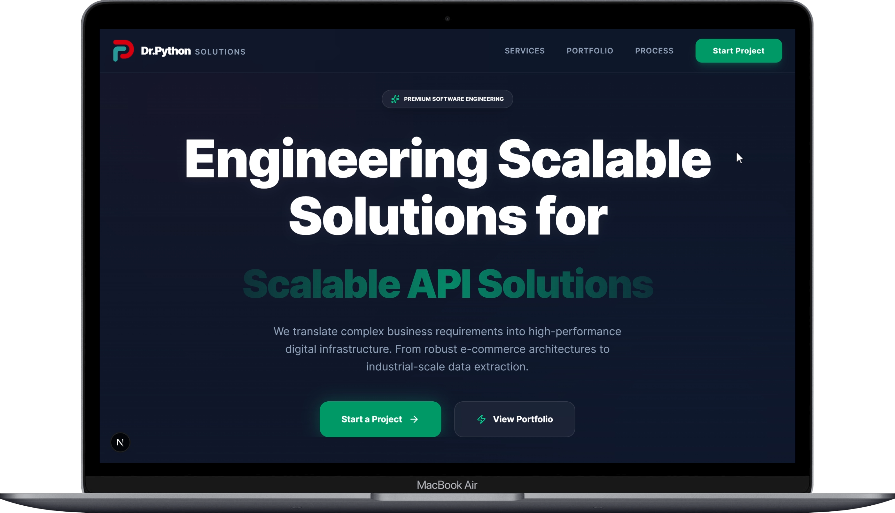
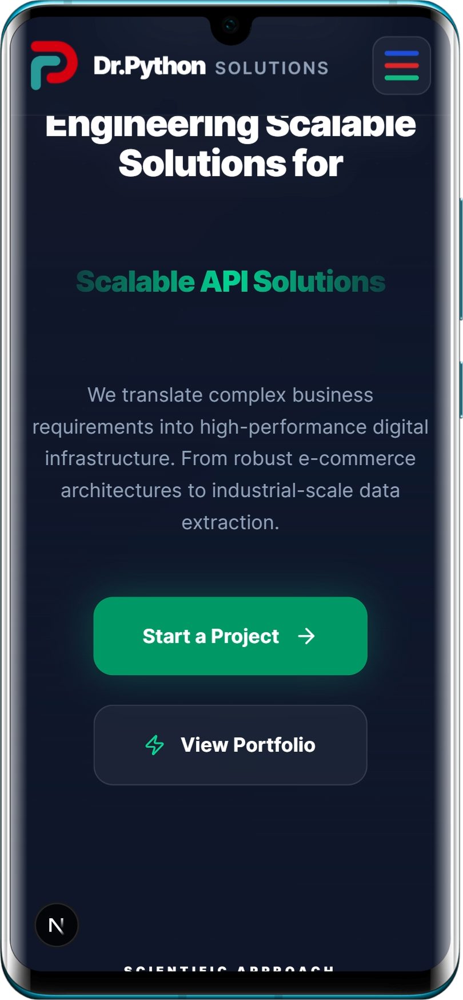

# Dr. Python Solutions

**Industrial-Grade Engineering for E-commerce, APIs, and Web Automation.**

Dr. Python Solutions is a high-performance web agency specializing in scalable data extraction, robust API architectures, and premium e-commerce experiences. Built with a focus on speed, reliability, and precision.

## 🚀 Visual Previews

### Desktop Experience


### Mobile Optimized


---

## 🛠️ Tech Stack

- **Core**: [Next.js 16](https://nextjs.org/) (App Router)
- **Styling**: [Tailwind CSS V4](https://tailwindcss.com/)
- **Animations**: [Framer Motion](https://www.framer.com/motion/)
- **Icons**: [Lucide React](https://lucide.dev/)
- **Architecture**: Modular Component-Based Design

## ✨ Key Features

- **Industrial Aesthetic**: A high-contrast "Midnight Aurora" theme with glassmorphic UI elements and premium brand-aligned accents.
- **Scalable Solutions**: Engineered to handle high-frequency data pipelines and high-velocity e-commerce traffic.
- **Mobile First**: Fully responsive layout with optimized mobile sliders, touch-friendly navigation, and reduced vertical whitespace for small screens.
- **Dynamic Interactions**: Smooth scroll reveals, hovering glow effects, and animated state transitions for a premium user experience.

## 📦 Navigation Sections

- **Hero**: Prioritizing E-commerce, API, and Automation services with a dynamic headline engine.
- **Expertise**: Interactive glassmorphic cards showcasing core technical competencies.
- **Services**: A detailed breakdown of industrial-scale scraping and API ecosystem capabilities.
- **Dashboard Showcases**: Premium visual mockups of custom management interfaces.
- **Live Stats**: Real-time project metrics with animated counters and engineering grid backgrounds.
- **Contact Protocol**: A streamlined "Midnight" aesthetic form for project initialization.

## 🛠️ Getting Started

### Prerequisites
- Node.js 18+ 
- npm or yarn

### Installation

1. **Clone the repository**
   ```bash
   git clone https://github.com/samircd4/web_agency_frontend.git
   cd web_agency_frontend
   ```

2. **Install dependencies**
   ```bash
   npm install
   ```

3. **Run the development server**
   ```bash
   npm run dev
   ```

Open [http://localhost:3000](http://localhost:3000) to view the application.

---

## 📄 License
This project is proprietary. All rights reserved.
